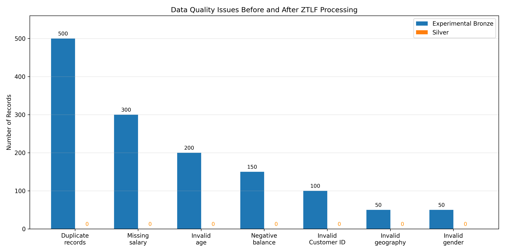

# Zero-Trust Lakehouse Framework (ZTLF)

Reference repository for the research project:

**A Zero-Trust Lakehouse Framework for Secure Data Governance, Intelligent Data Quality, and AI-Ready Analytics: Design, Implementation, and Experimental Evaluation**

**Author:** Ramesh Babu Kallam  
**ORCID:** https://orcid.org/0009-0008-5220-1775

## Overview

ZTLF is an implemented cloud-data architecture that integrates:

- secretless access through managed identity;
- storage authorization through Azure role-based access control;
- centralized governance through Unity Catalog;
- Bronze, Silver, Gold, and Quarantine data zones;
- deterministic data-quality validation;
- duplicate isolation;
- Delta Lake persistence; and
- preparation of analytics-ready and AI-ready data.

The evaluated workflow used a 10,000-record source dataset and a
10,500-record controlled experimental dataset. It isolated 850
rule-invalid records and 500 duplicate records, producing 9,150
validated Silver and Gold records.

## Repository status

This repository contains the sanitized Databricks notebooks and supporting
reproducibility documentation for the implemented ZTLF experimental workflow.

Environment-specific credentials, workspace identifiers, private storage
details, and the original source dataset are intentionally excluded.

The notebooks require users to configure their own Azure Databricks,
Unity Catalog, and ADLS Gen2 environment before execution.

## Architecture

The implementation uses:

- Azure Data Lake Storage Gen2
- Azure Databricks
- Apache Spark
- Delta Lake
- Unity Catalog
- Azure RBAC
- Azure Databricks Access Connector with managed identity

See [`docs/architecture.md`](docs/architecture.md).

## Experimental result

| Stage | Records |
|---|---:|
| Original source | 10,000 |
| Experimental Bronze | 10,500 |
| Rule-invalid | 850 |
| Duplicates | 500 |
| Quarantine | 1,350 |
| Silver | 9,150 |
| Gold | 9,150 |

Gold validation reported zero duplicate customer IDs and zero null
engineered features.

### Data-quality result



## Repository map

```text
.
├── docs/          Research and reproducibility documentation
├── figures/       Shareable project figures
├── notebooks/     Sanitized Databricks notebooks when released
├── paper/         Publication metadata; manuscript release is deferred
├── sample-data/   Schema and synthetic-data guidance
├── src/           Reusable validation modules when released
├── CITATION.cff
├── CONTRIBUTING.md
├── SECURITY.md
└── README.md
```

## Reproducibility

The repository does not currently claim one-click reproducibility.
Azure resources, Databricks Runtime versions, Unity Catalog objects,
storage paths, and package versions must be documented from the actual
experimental environment before an executable release.

See [`docs/reproducibility.md`](docs/reproducibility.md).

## Data availability

The experiment used a file named `Churn_Modelling.csv`. The original
acquisition record and license were not preserved. Public redistribution
is therefore deferred until the authoritative source and license are
verified. The repository will use a synthetic or clearly licensed sample
for public reproducibility.

See [`docs/dataset-provenance.md`](docs/dataset-provenance.md).

## Citation

Citation metadata is provided in [`CITATION.cff`](CITATION.cff).
Journal metadata should be updated after publication.

## License

This project is licensed under the Apache License 2.0. See the
[LICENSE](LICENSE) file for details.

The repository license applies only to the original source code,
documentation, and figures contributed by the author. It does not apply
to third-party datasets, Azure services, Apache Spark, Delta Lake, Unity
Catalog, or other third-party software and services, each of which
remains subject to its own license or terms of use.
